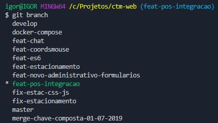
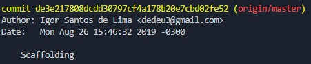
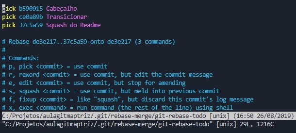
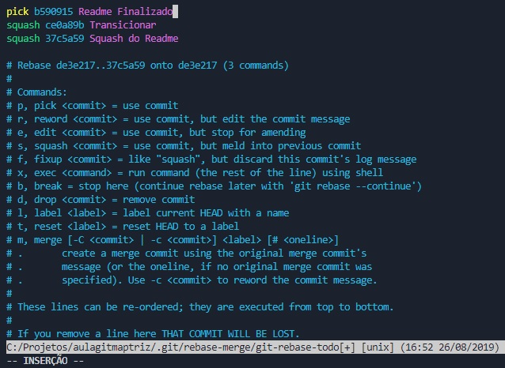
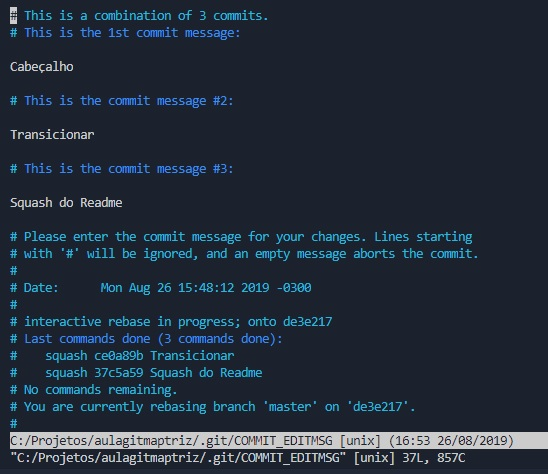

# Comandos básicos do Git

## Branch

Lista todas as branches que existem no seu repositório local e marca em qual você está.

```git branch```



-------

## Checkout

Transiciona para a branch desejada.

```git checkout nome_da_branch```

É possível também criar uma branch nova.

```git checkout -b nome_da_branch```

__ADENDO__

Caso, você esteja tentando se mover para uma branch que existe remotamente, mas seu git local não a reconheça, rode o comando **fetch**

```git fetch -a```

-------

## Clone
Usado para clonar um repositório que se encontra remoto (no servidor do git) para o seu computador.

```git clone https://github.com/igorpwnd/aulagitmaptriz.git```

É possível também clonar uma branch específica em vez de ir diretamente a *master*

```git clone -b feat-modal-novo https://github.com/igorpwnd/aulagitmaptriz.git```

-------

## Add/Rm
*add*\
Adiciona arquivo ou diretório

*rm*\
Remove arquivo ou diretório

```git add .```\
```git rm .```

No lugar do ponto pode ser o nome do arquivo/diretório que você quer remover ou adicionar da seleção para o commit.

-------

## Commit 
Commit é a operação realizada onde confirmam-se as mudanças selecionadas ou removidas com os comandos **add** ou **rm**. Normalmente, coloca-se uma mensagem junto ao commit para poder identificá-los.

```git commit -m "Mensagem que você deseja"```

-------

## Push
Envia para o servidor remoto todos os commits que se realizados anteriormente 

```git push origin nome_da_branch```

-------

## Pull
Traz todas as novas modificações feitas na branch em questão

```git pull origin nome_da_branch```


# Como transicionar entre commits

## Histórico de commits
Irá trazer um histórico dos commits, contendo seu Id, autor, tempo e mensagem.\
```git log```

Para fazer com que o **viaje** até este commit é possível utilizar 2 comandos. Existem diferenças entre **--hard** e **--soft**.\
\
Resumidamente o hard vai até o código com ele commitado e o soft vai até o codigo, sem commit.




```git reset --hard id_do_commit```

ou

```git reset --soft id_do_commit```

-------
## *Exemplo*

```git reset --hard de3e217808dcdd30797cf4a178b20e7cbd02fe52```

ou

```git reset --soft de3e217808dcdd30797cf4a178b20e7cbd02fe52```

# Comandos Adicionais 

## Como pegar meu código e jogá-lo num lugar pra eu ver depois

Dá pra pegar de volta depois e até jogar no seu código atual

```git stash```

## Voltar pra minha última branch

```git checkout -```

## Apagar minhas modificações sem salvar nada
```git checkout .```

## Como fazer ***squash*** dos commits
Primeiramente, por quê?\
\
Imagine o seguinte cenário, você faz um código importante e conclui sua tarefa.\
\
Após terminar sua tarefa (e fazer o commit), você percebe que esqueceu de remover um console.log do código.\
\
Ficarão 2 commits no seu push para o repositório, o commit da tarefa finalizada e o commit da remoção do console.log, um commit adicional como esse não é necessário e pode ser até não estético, nesse caso pode-se fazer o ***squash***.

```git rebase -i```

Mostrará as opções para fazer o **squash**, **pick** será o commit mantido e **squash** será combinado com o **pick** mais perto. (**É NECESSÁRIO TER SEMPRE UM PICK ACIMA**)


Alterne de ***pick*** para ***squash***



Depois comente, remova ou faça o que quiser com os comentário de cada ***commit***



*Vale ressaltar que todas essas modificações são todas dentro do terminal no VIM, que é aberto automaticamente.*

Caso queria conferir como o seu ***commit*** ficou é só rodar. \
```git log```

Lá estão todos os seus ***commits*** com suas mensagens, caso o git esteja alegando algum problema para fazer o push, insira --force como seu sufixo.